# Modélisation numérique d'un matériau magnétique

Du sujet d'informatique **Mines-Ponts 2022** (champ moyen de Weiss, base de données, modèle d'Ising 2D,
domaines de Weiss) à une petite boîte à outils de physique statistique : Monte-Carlo Metropolis et
Wolff, solution exacte d'Onsager, mise à l'échelle en taille finie, hystérésis, coarsening,
antiferromagnétisme, base SQL de matériaux réels.

```bash
pip install -r requirements.txt        # numba est optionnel mais accélère ×50-100
python -m pytest -q                    # 33 tests
python -m magnetisme figures           # régénère toutes les figures (quelques minutes)
python -m magnetisme figures --rapide  # version réduite (~15 s)
python -m magnetisme interactif        # simulateur à curseurs (T, B), Metropolis/Wolff
python -m magnetisme simuler -L 64 -T 2.0 --algo wolff --image conf.png
python -m magnetisme balayage -L 32 --tmin 1.5 --tmax 3.5 > data.csv
python -m magnetisme domaines -T 2.269 --image weiss.png
python -m magnetisme champ-moyen 0.3 0.9 # résout m = tanh(m/t)
python -m magnetisme sql                 # requêtes 6 à 9 du sujet
python -m magnetisme examen              # corrigé Python pur (sans numpy) du sujet
```

## Organisation

| Chemin | Rôle |
|---|---|
| `magnetisme/ising.py` | Ising 2D : Metropolis (numba / repli numpy en damier), Wolff, observables, jackknife, τ_int |
| `magnetisme/theorie.py` | champ moyen, Brillouin, Landau, Curie-Weiss, Onsager exact (M, e, C, ξ) |
| `magnetisme/weiss.py` | domaines de Weiss (composantes connexes périodiques), statistiques, corrélations |
| `magnetisme/analyse.py` | balayage en T, Binder, exposants, hystérésis, trempe, ralentissement critique |
| `magnetisme/materiaux.py` | base SQLite (`data/*.sql`) et requêtes Q6-Q9 |
| `magnetisme/examen_mines_2022.py` | corrigé commenté des 24 questions, Python pur |
| `magnetisme/figures.py`, `interactif.py`, `__main__.py` | figures, GUI, CLI |
| `legacy/` | anciens scripts (conservés ; voir « Corrections ») |

Conventions : `E = -J Σ⟨ij⟩ sᵢsⱼ - B Σ sᵢ`, `kB = 1`, bords périodiques ; `Tc = 2J/ln(1+√2) ≈ 2,269`.

## Résultats

### 1. Champ moyen (partie I) vs solution exacte
Le champ moyen donne `m = tanh(m/t)` (exposant β = 1/2, Tc = 4J) alors que l'Ising 2D exact (Onsager–Yang)
a β = 1/8 et Tc = 2,269 J : les fluctuations abaissent Tc de 43 %.
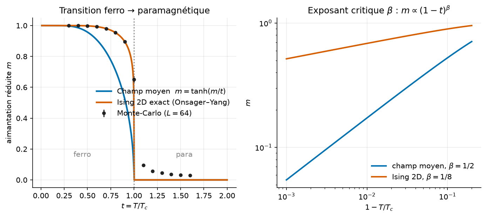

### 2. Configurations selon la température (fig. 5 du sujet)
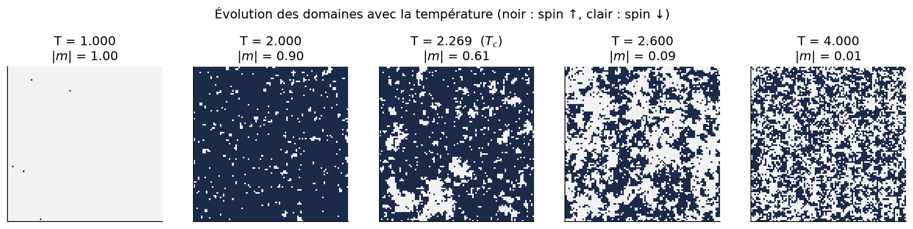

### 3. Observables et accord avec Onsager
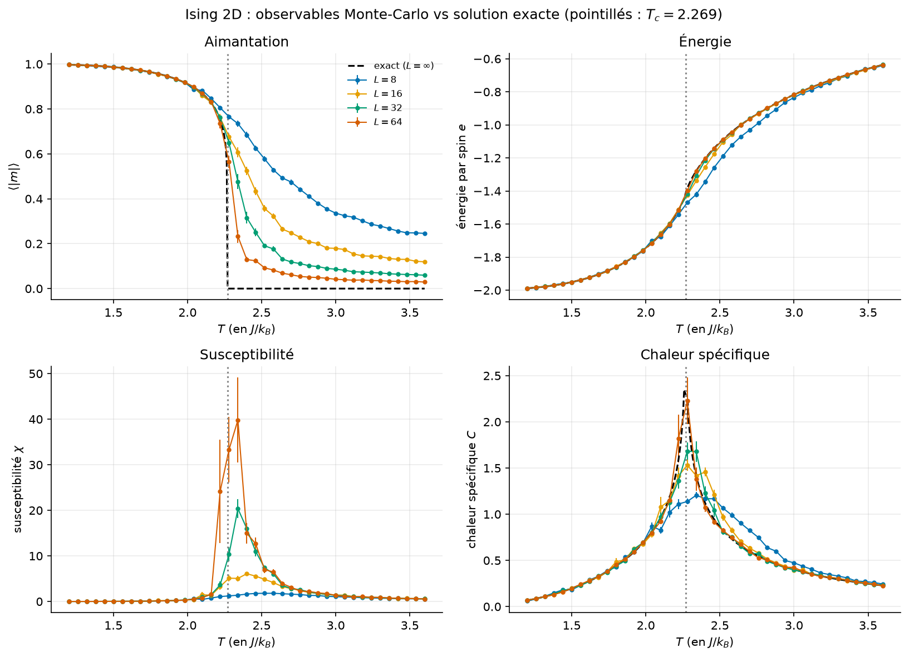

### 4. Cumulant de Binder et collapse de taille finie
Croisement des U₄ au point `Tc` et collapse avec β/ν = 1/8, γ/ν = 7/4.
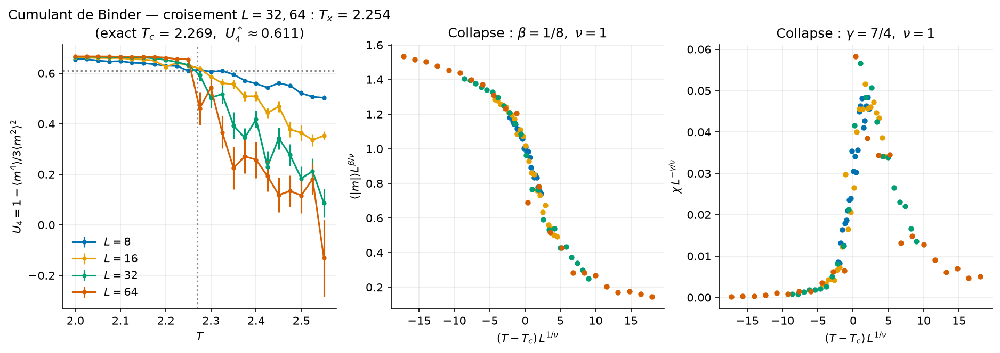

### 5. Domaines de Weiss (partie IV)
À Tc la distribution des tailles de domaines devient une loi de puissance (invariance d'échelle).
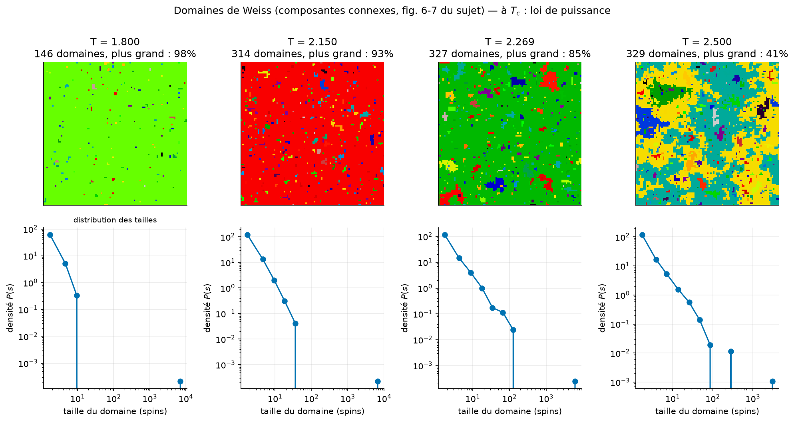

### 6. Corrélations et divergence de ξ
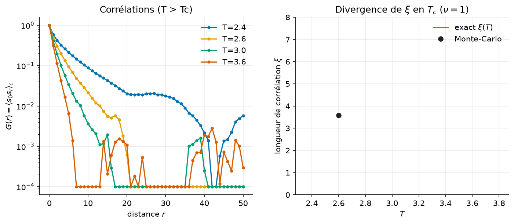

### 7. Hystérésis et nucléation
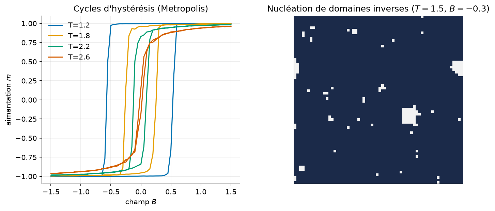

### 8. Trempe : croissance de domaines ℓ(t) ∝ t^½
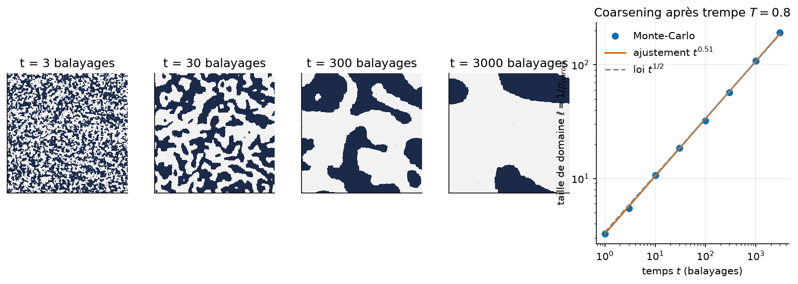

*Animation :* `figures/14_trempe_animation.gif`

### 9. Antiferromagnétisme
Sur réseau bipartite, `T_N = Tc` : le paramètre d'ordre alterné suit exactement la courbe ferro.
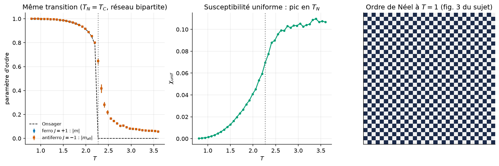

### 10. Curie-Weiss
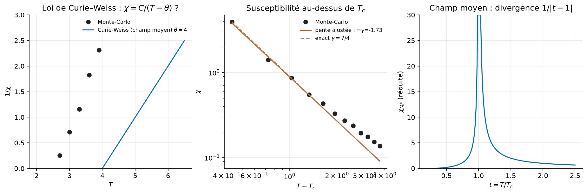

### 11. Landau et effet d'un champ
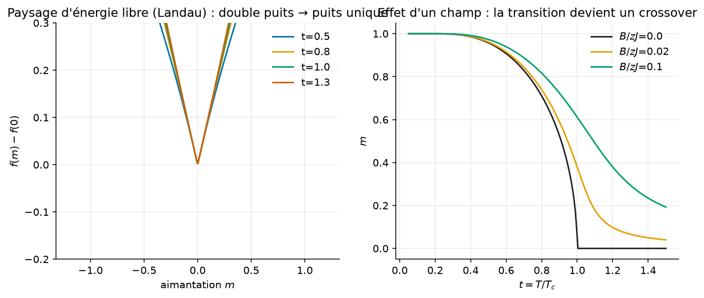

### 12. Algorithme de Wolff vs Metropolis (ralentissement critique)
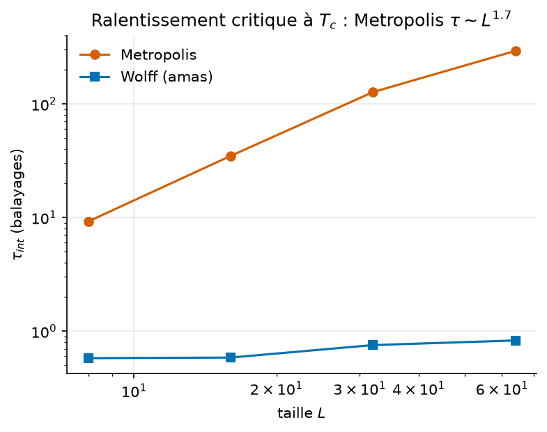

### 13. Matériaux réels (partie II) et modèle de Weiss–Brillouin
Les `T_C` sont tirées de la littérature ; `J` effectifs et `M_s` sont des ordres de grandeur ; les **prix
sont fictifs**.
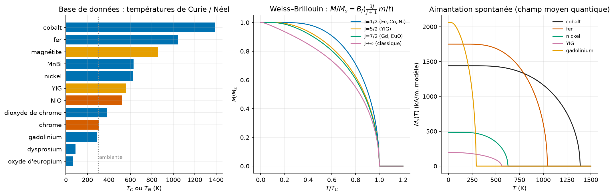

## Corrections apportées aux scripts d'origine
- `Weiss.py` appelait `initialisation()` non définie (NameError) ; les fichiers affichaient des listes de
  10 000 éléments à l'import ; `_erromagnétique.py` dupliquait la partie I → remplacés par
  `examen_mines_2022.py` sans effet de bord.
- Q8 : `ORDER BY … LIMIT 1` perd les ex æquo exigés par le sujet → sous-requête `MIN`.
- `explorer_voisinage_pile` marque à l'empilement (pas de doublons) ; `liste_voisins` via `//` et `%`.
- Q16 : `calcul_delta_e2` en O(1) contre O(n) pour `calcul_delta_e1` (testé équivalent).

## Pour aller plus loin
Heisenberg/XY (Mermin–Wagner, transition BKT), 3D (β ≈ 0,326), frustration (triangulaire AF),
Wang-Landau, champ aléatoire, ou réseau de neurones comme émulateur de `M(T)`.
